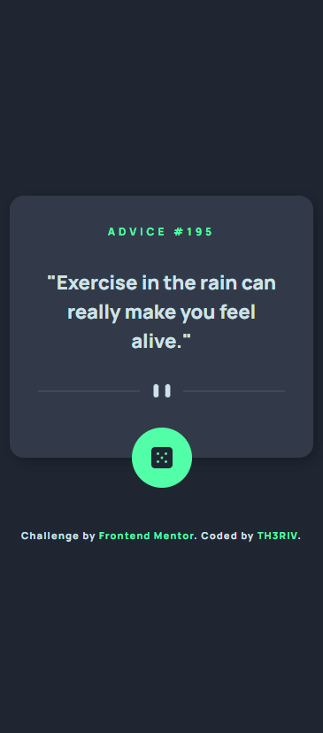
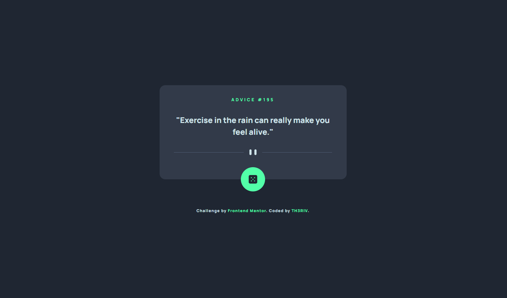

# Frontend Mentor - Advice generator app solution

This is a solution to the [Advice generator app challenge on Frontend Mentor](https://www.frontendmentor.io/challenges/advice-generator-app-QdUG-13db). Frontend Mentor challenges help you improve your coding skills by building realistic projects.

## Table of contents

- [Overview](#overview)
  - [Screenshot](#screenshot)
  - [Links](#links)
- [My process](#my-process)
  - [Built with](#built-with)
  - [Useful resources](#useful-resources)
- [Author](#author)

## Overview

### Screenshot

### Links

- Solution URL: [FOR SOLUTION - CLICK HERE!](https://www.frontendmentor.io/solutions/advice-generator-app-okjc_z7lfQ)
- Live Site URL: [FOR LIVE SITE - CLICK HERE!](https://th3riv.github.io/challenges/Frontend-Mentor/C11-Advice-Generator/)

## My process

1. Look at all the provided designs and style information.
2. Plan out the work order.
3. Complete the HTML.
4. Style using CSS.
5. Make it functional with JS.
6. Make sure my project looks as close to the provided design as possible.
7. Have a well deserved mug of coffee.
8. Upload the solution.

### Built with

- Semantic HTML5 markup.
- CSS custom properties.
- Vanilla Javascript.
- Mobile-first workflow.
- Responsive Design.

### Useful resources

- [Resources](links) - Descriptions

## Author

- Website - [https://th3riv.github.io/](https://th3riv.github.io)
- Frontend Mentor - [@TH3RIV](https://www.frontendmentor.io/profile/TH3RIV)
- Twitter - [@rivera2444](https://www.twitter.com/rivera2444)